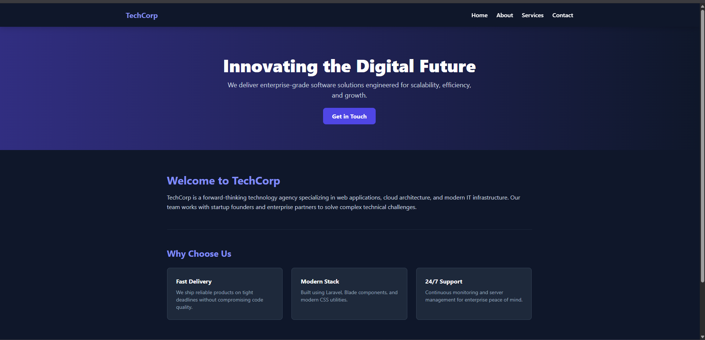
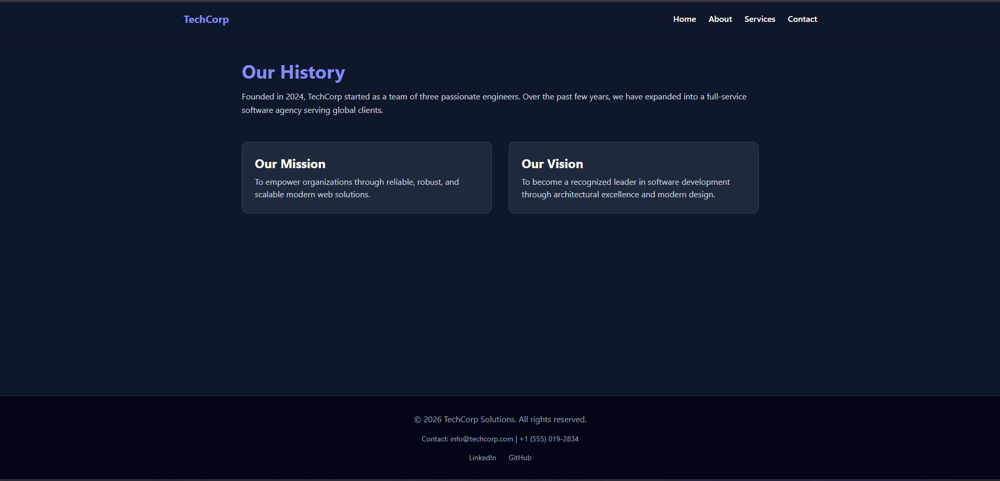
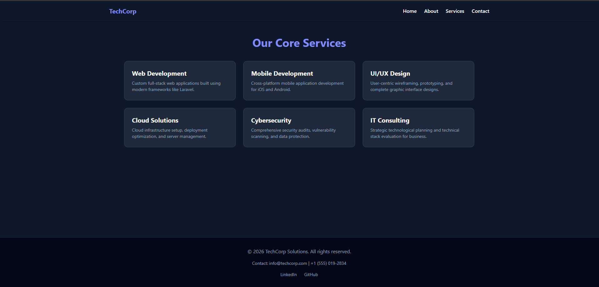
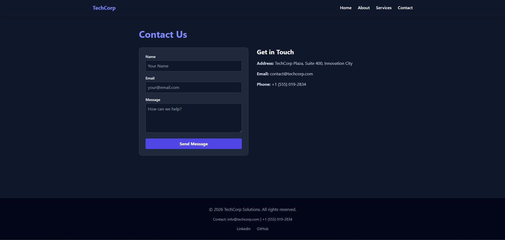
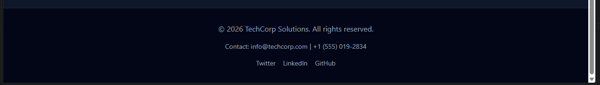
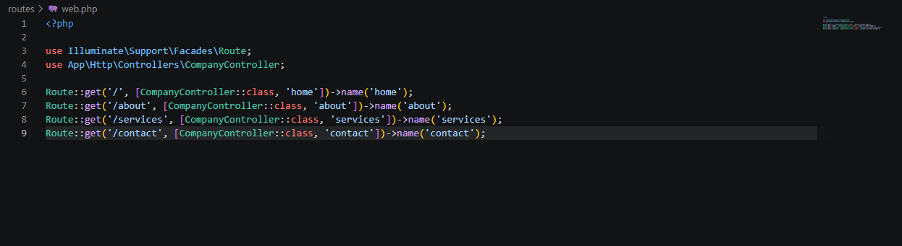
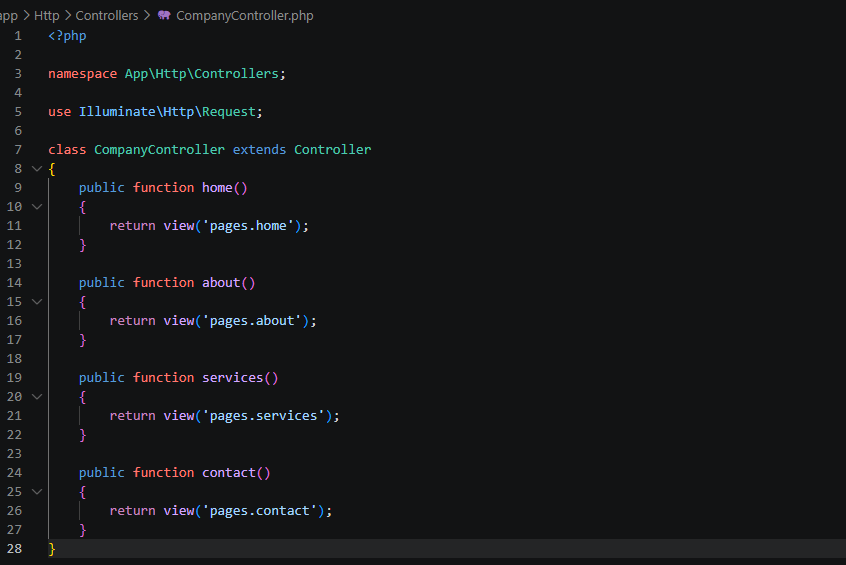
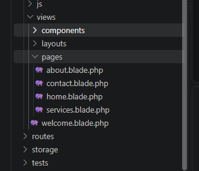

# 1. Company Profile Website - TechCorp Solutions

## 2. Introduction

### What is a Company Profile Website?
A Company Profile Website is an official online platform that introduces a business to potential clients, customers, and partners. It presents important information such as the company's background, services, mission, vision, and contact details. It also serves as a digital representation of the business and helps establish credibility in the online market.

### Why Businesses Need One
A company profile website helps organizations build trust with customers by providing accurate and accessible information. It is available 24/7, allowing visitors to learn about the company, explore its services, and contact the business anytime. It also strengthens the company's online presence and improves brand recognition.

### Purpose of the Project
The purpose of this project is to develop a multi-page Company Profile Website using the Laravel framework and its Model-View-Controller (MVC) architecture. The project demonstrates the implementation of Laravel routing, controllers, Blade templating, reusable components, and organized project structure while applying best practices in web development.

---

## 3. Objectives
* Configure application routes using Laravel Routing (`routes/web.php`).
* Develop a `CompanyController` to process user requests.
* Create reusable Blade layouts and components.
* Build dynamic pages for Home, About, Services, and Contact.
* Apply Laravel's MVC architecture in a real-world project.
* Organize project files according to Laravel's directory structure.
* Document the project using proper Markdown formatting.

---

## 4. MVC Architecture

### What is MVC?
Model-View-Controller (MVC) is a software architecture that separates an application into three main components: the Model, the View, and the Controller. This separation improves code organization, maintainability, and scalability.

### Why Laravel Uses MVC
Laravel uses the MVC architecture to organize application logic efficiently. It separates business logic from the user interface, making applications easier to develop, test, and maintain.

### Advantages of MVC
1. **Separation of Concerns:** Business logic remains independent from the user interface.
2. **Maintainability:** Changes to one component have minimal impact on other parts of the application.
3. **Scalability:** Applications can be expanded without significantly modifying the existing structure.
4. **Team Collaboration:** Front-end and back-end developers can work independently on different parts of the project.

### Request Flow Diagram

Browser
   │
   ▼
Route (`routes/web.php`)
   │
   ▼
Controller (`CompanyController.php`)
   │
   ▼
Blade View (`resources/views/pages/*`)
   │
   ▼
Response to Browser

---

## 5. Laravel Routing

### What is Routing?
Routing defines how incoming HTTP requests are directed to specific controller methods. It allows Laravel to determine which page or function should be executed when a user visits a particular URL.

### Key Concepts
* **GET Requests:** Used to retrieve and display web pages.
* **Route Definitions:** Map URLs to controller methods.
* **Named Routes:** Allow routes to be referenced easily throughout the application.

### Route Definitions (`routes/web.php`)
```php
<?php

use Illuminate\Support\Facades\Route;
use App\Http\Controllers\CompanyController;

Route::get('/', [CompanyController::class, 'home'])->name('home');
Route::get('/about', [CompanyController::class, 'about'])->name('about');
Route::get('/services', [CompanyController::class, 'services'])->name('services');
Route::get('/contact', [CompanyController::class, 'contact'])->name('contact');
---

6. Controllers
Purpose of Controllers
Controllers process incoming requests, execute the required application logic, and return the appropriate Blade view to the user. This keeps routing files clean and organizes application logic into reusable classes.

Controller Methods
Inside app/Http/Controllers/CompanyController.php:

home(): Displays the Home page (pages.home).

about(): Displays the About page containing the company's history, mission, and vision (pages.about).

services(): Displays the list of services offered by the company (pages.services).

contact(): Displays the Contact page with the contact form and company information (pages.contact).

---

7. Blade Templating Engine
What is Blade?
Blade is Laravel's built-in templating engine that enables developers to create reusable layouts and components while keeping HTML code organized.

Key Features
Blade Layouts: Shared templates that provide a common structure for all pages.

Blade Components: Reusable interface elements such as the navigation bar and footer.

Blade Directives:

@extends('layouts.app')

@section('content')

@yield('content')

@include('components.navbar')

@include('components.footer')

Sample Layout (resources/views/layouts/app.blade.php)

<!DOCTYPE html>
<html lang="en">
<head>
    <meta charset="UTF-8">
    <meta name="viewport" content="width=device-width, initial-scale=1.0">
    <title>@yield('title', 'Company Profile')</title>
    <script src="[https://cdn.tailwindcss.com](https://cdn.tailwindcss.com)"></script>
</head>
<body class="bg-slate-900 text-slate-100 flex flex-col min-h-screen">

@include('components.navbar')

<main class="flex-grow">
    @yield('content')
</main>

@include('components.footer')

</body>
</html>
---

8. Laravel Folder Structure
app/: Contains application logic including Controllers, Models, and Middleware.

routes/: Stores all application route definitions such as web.php.

resources/: Contains Blade templates, CSS, JavaScript, and other frontend resources.

public/: Stores publicly accessible assets including CSS, JavaScript, images, and index.php.

bootstrap/: Contains framework bootstrap files and cache configuration.

config/: Contains configuration files for application services and database connections.

### Screenshots










10. Problems Encountered
Problem 1: Database Session Exception
Issue: The application displayed the error SQLSTATE[HY000]: General error: 1 no such table: sessions because the required session table had not yet been created.

Problem 2: Unstyled HTML Output
Issue: Page content appeared outside the website layout because it was placed outside the @section('content') and @endsection directives.

Problem 3: Missing PHP Extensions
Issue: Laravel could not connect to SQLite because the pdo_sqlite and sqlite3 extensions were disabled.

11. Solutions
Solution 1
Executed the php artisan migrate command to generate the required database tables.

Solution 2
Placed all page content inside the @section('content') block so it inherited the master layout correctly.

Solution 3
Enabled the extension=pdo_sqlite and extension=sqlite3 directives inside C:\php\php.ini and restarted the web server.

12. Reflection
1. Learning Laravel MVC
This project helped me understand how Laravel organizes applications using the MVC architecture. Separating the application into Models, Views, and Controllers made the project easier to develop and maintain.

2. Understanding the Request Flow
I learned how Laravel receives a request, processes it through routing, executes the appropriate controller method, and renders a Blade template before sending the final response to the browser.

3. Benefits of Blade Templates
Using reusable layouts and components such as app.blade.php, navbar.blade.php, and footer.blade.php reduced duplicate code and made updating the website much easier.

4. Challenges Encountered
The project introduced several technical challenges including missing database tables, disabled PHP extensions, and layout rendering issues. Solving these problems improved my troubleshooting and debugging skills.

5. Overall Experience
Overall, this project strengthened my knowledge of Laravel Routing, Controllers, Blade Templates, and MVC Architecture. It also improved my confidence in building structured and maintainable web applications using industry-standard development practices.

---

References
Laravel Documentation. (2026). Laravel – The PHP Framework for Web Artisans. https://laravel.com/docs

PHP Documentation. (2026). PHP Manual: PHP Data Objects (PDO). https://www.php.net/manual/en/book.pdo.php

Tailwind CSS Documentation. (2026). Tailwind CSS Documentation. https://tailwindcss.com/docs

MDN Web Docs. (2026). An overview of HTTP requests and responses. https://developer.mozilla.org/en-US/docs/Web/HTTP/Overview